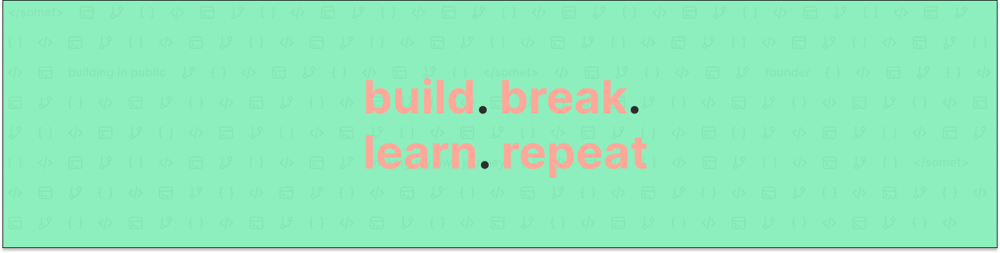

# Hey, I'm Thomas 👋
💻 I help founders & creators as a Concierge CTO  
👨‍💻 Coding, creating and sometimes parenting  
🧔‍♂️ Also growing a beard  
📍 Frenchman in Amsterdam

🔔 Follow my journey on Instagram

      
## 🌐 Socials:
  
 

# 💻 Tech Stack:

# 🤓 Personal Stack:

# 📊 GitHub Stats:
 
 

<!-- Proudly created with GPRM ( https://gprm.itsvg.in ) -->
